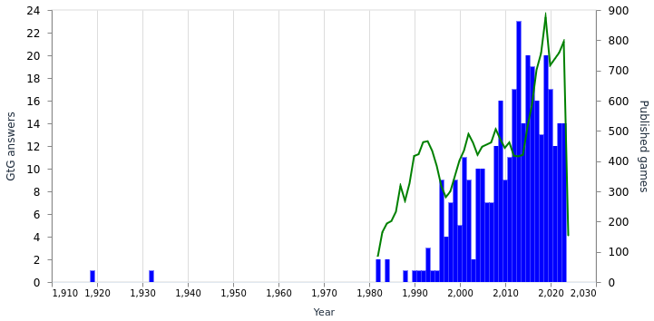

# Gtgcrawler

There was talk about [Guess the Game](https://guessthe.game) in one of my
communities, and a person said that GtG has a bias towards more recent games.
I was immediately interested in this claim, because it seems like it should be
possible to find out if this is the case. My idea was that I would get the
publication years for all the GtG answers and compare that to the overall
amount of games published on the same year.

The timing was also good because I wanted an excuse to play with Elixir. After
a bit of searching I found [an article about using Crawly](https://www.scrapingbee.com/blog/web-scraping-elixir/)
which seemed to fit the ticket.

I initially wrote a scraper in a mix project for a results website that claimed
to have GtG answers for one year, but later learned that GtG has an API where
I can just grab all the answers from. I then integrated both that and the rest
of the processing into a [livebook](https://livebook.dev), because I wanted
to play more with that as well.

Now the livebook does the following:

1. Grab the answers from the GtG API
2. Using game titles, try querying wikidata.org (the structured data service
   behind wikipedia) for the publication year
3. Crawl a general videogame statistics website to get an idea of how many
   games were published for a given year
4. Visualize the two datasets for visual comparison

The crawlers try to be Nice in a couple of ways:

- They respect site's [robots.txt](https://en.wikipedia.org/wiki/Robots.txt) files
- They send a User-Agent string that includes identifying information

## Running it

Run it by installing [livebook](https://livebook.dev), opening [game-data-maelving.livemd](game-data-maelving.livemd) and executing the cells. It is not necessary to re-run the crawlers,
instead one can use the data files included in the repo.

The `start-livebook.sh` script can be used to run livebook in Docker.

## Results

This is still far removed from actual science, but there seems to be a
correlation between the number of overall published games and the number
of GtG puzzle answers for a given year. That makes me conclude that there
is no significant bias towards more recent games in GtG.

